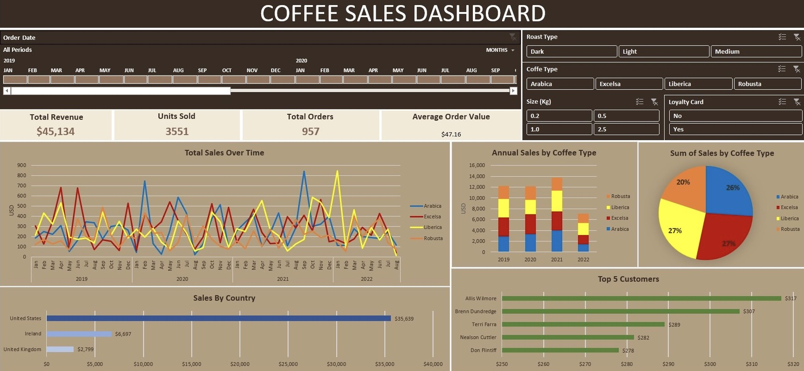

# Coffee Sales 2019-2022 Dashboard (Excel)

## Project Overview
This project demonstrates an end-to-end data analysis process using Microsoft Excel. The primary focus is transforming raw relational data tables into an interactive dashboard. This workflow encompasses data cleaning, table merging using lookup functions, data aggregation using `Pivot Tables`, and dynamic visualization.

## Report Preview
Below is a preview of the dashboard:

## Steps Involved

### 1. Data Preparation & Merging
The initial dataset consists of three separate tables: `Orders` (fact table), `Customers`, and `Products` (dimension tables). Data preparation was performed directly in Excel:
- Retrieved customer attributes (*Customer Name*, *Email*, *Country*) from the `Customers` table into the `Orders` table using a combination of `INDEX` and `MATCH` functions.
- Retrieved product specifications (*Coffee Type*, *Roast Type*, *Size*, *Unit Price*) from the Products table using a combination of `INDEX` and `MATCH` functions.
- Applied `IF` logic to clean formatting, such as inserting text placeholders for blank Email cells.
- Calculated the Sales column by multiplying Quantity by *Unit Price*.

### 2. Data Processing (Pivot Tables)
Once the main `Orders` table was populated, the data was summarized using several `Pivot Tables` distributed across calculation sheets:
- **KPI Summary:** Aggregated top-level business health metrics, including **Total Revenue ($45,134)**, **Units Sold (3,551)**, **Total Orders (1,000)**, and **Average Order Value ($45.13)**.
- **Total Sales Over Time:** Aggregated total revenue by Year and Month to analyze historical trends and seasonality.
- **Annual Sales by Coffee Type:** Aggregated sales data by year and segmented by coffee type to evaluate yearly product performance and contribution.
- **Sum of Sales by Coffee Type:** Calculated the all-time gross sales for each coffee variant to determine the overall market share.
- **Sales by Country:** Calculated total sales per operating country to compare market penetration.
- **Top 5 Customers:** Sorted and filtered the top 5 customers based on their highest accumulated purchase value.

### 3. Dashboard Creation & Visualization
The `Pivot Tables` were compiled into a single, cohesive Dashboard sheet:
- Built a **Line Chart** to track monthly sales trends.
- Built a **Stacked Column Chart** to illustrate the annual sales composition by coffee type.
- Built a **Donut Chart** to visualize the overall sales proportion and identify the top-selling coffee variant.
- Built **Bar Charts** to display country contributions and top customer rankings.
- Integrated interactive elements including `Slicers` (*Roast Type*, *Size*, *Loyalty Card*) and a `Timeline` (*Order Date*).
- Linked the `Slicers` to all charts using **Report Connections**, ensuring the entire dashboard responds to filters simultaneously.
  
## Key Insights
- **The United States** market heavily dominates total revenue generation (**approx. 79% or $35,638**), significantly outpacing the Ireland and United Kingdom markets.
- **Coffee preferences** differ significantly by country. The United States favors **Arabica**, Ireland prefers **Liberica**, and the United Kingdom leans toward **Excelsa**.
- **Packaging size 2.5 kg** acts as the primary revenue driver, accounting for over **50% of the total gross sales ($23,785)**, despite having a lower total unit sold compared to smaller packaging variants.
- **Arabica** generates the highest number of orders (262) and units sold (947). However, **Excelsa** drives the highest total revenue ($12,306) due to its superior average order value ($50.64 compared to Arabica's $44.92). 
- **Robusta** sells more units (878) than Excelsa and Liberica, but it brings in the lowest revenue ($9,005) because of its low average order value ($37.68). Its annual sales have remained stagnant at around $2,400 from 2019 to 2021.
- **Total revenue** reached an all-time high in **2021 ($13,766)**, primarily driven by a massive surge in demand for Arabica ($4,046) and Liberica ($3,837). In contrast, Excelsa's sales dropped in 2021 after leading the market in 2019 and 2020.
- **Non-loyalty customers** demonstrate a higher average order value ($46.48) compared to customers enrolled in the loyalty program ($43.67), indicating a potential inefficiency in the current reward structure.
- **The top 5 customers** demonstrate strong retention through consistent repeat purchases, accumulating individual total spends between **$278 and $317**. This indicates high loyalty, as their total spend is roughly 6 to 7 times the overall average order value ($45).

## Recommendations
- The business is highly dependent on the United States market (79% of revenue). To diversify the revenue stream, expand in Ireland and the United Kingdom by tailoring campaigns to regional tastes. Promote Arabica heavily in the US, Liberica in Ireland, and Excelsa in the UK.
- Since Excelsa drives the highest revenue and Arabica drives the most orders, the business should ensure consistent stock for Arabica to meet volume demand, while maintaining a strong sales focus on Excelsa to maximize overall revenue.
- Robusta has high unit sales but generates the lowest revenue, and its sales have remained stagnant since 2019. The business should evaluate this product's performance to determine if any adjustments are needed to improve its value.
- Total revenue peaked in 2021 due to a surge in Arabica and Liberica. Reviewing historical data and customer behavior from that specific year could help the business understand what drove the demand and improve future sales forecasting.
- Non-loyalty customers have a higher average order value than loyalty customers, which suggests that the current loyalty program may not be effective and should be reviewed.

## Contact
**LinkedIn**: [https://www.linkedin.com/in/adhisandira](https://www.linkedin.com/in/adhisandira)  
**Email**: andiraadhis@gmail.com
